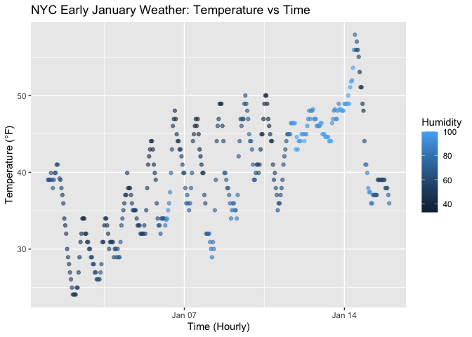

p8105_hw1_yc4804
================
Yilin Cai
2025-09-20

## Problem 1

``` r
#load data packages
library(moderndive)
library(ggplot2)
data("early_january_weather")
```

The dataset early_january_weather contains hourly weather observations
at LaGuardia Airport in early January 2013. The variable names are:
origin, year, month, day, hour, temp, dewp, humid, wind_dir, wind_speed,
wind_gust, precip, pressure, visib, time_hour. Important variables for
our analysis are time_hour, temp, and humid. The dataset has 358 rows
and 15 columns. The average air temperature is 39.6 °F.

``` r
# Create a scatterplot of temperature vs time, colored by humidity
p_temp_time<-ggplot(
  early_january_weather,
  aes(x = time_hour, y = temp, color = humid)
) +
  geom_point(alpha = 0.6) +
  labs(
    x = "Time (Hourly)",
    y = "Temperature (°F)",
    color = "Humidity",
    title = "NYC Early January Weather: Temperature vs Time"
  ) 
p_temp_time
```

<!-- -->

Temperatures show clear diurnal cycles and a gradual warm-up into
mid-January, peaking around Jan 13–14. Humidity (color scale) tends to
be higher at higher temperatures—lighter points are concentrated during
the warm spell—while darker (drier) points are more common during cooler
periods and overnight. Overall, the figure suggests a modest positive
temp–humidity relationship during this window, with day–night
fluctuations superimposed on the warming trend.

``` r
# export the image to the project directory
ggsave(filename = "temp_vs_time_scatter.png",  plot = p_temp_time, width = 7, height = 5, dpi = 300)
```

## Problem 2

``` r
library(tidyverse)
```

    ## ── Attaching core tidyverse packages ──────────────────────── tidyverse 2.0.0 ──
    ## ✔ dplyr     1.1.4     ✔ readr     2.1.5
    ## ✔ forcats   1.0.0     ✔ stringr   1.5.1
    ## ✔ lubridate 1.9.4     ✔ tibble    3.3.0
    ## ✔ purrr     1.1.0     ✔ tidyr     1.3.1
    ## ── Conflicts ────────────────────────────────────────── tidyverse_conflicts() ──
    ## ✖ dplyr::filter() masks stats::filter()
    ## ✖ dplyr::lag()    masks stats::lag()
    ## ℹ Use the conflicted package (<http://conflicted.r-lib.org/>) to force all conflicts to become errors

``` r
set.seed(123) # set seed for reproducibility

#Create the data frame
df_problem2 <- tibble(
  norm_sample = rnorm(10), #numeric: standard normal sample
  is_positive = norm_sample > 0, #logical: TRUE if > 0
  char_vec = letters[1:10], #character: letter a-j
  factor_vec = factor(rep(c("low", "med", "high"), length.out = 10)) #factor with 3 levels
)

df_problem2
```

    ## # A tibble: 10 × 4
    ##    norm_sample is_positive char_vec factor_vec
    ##          <dbl> <lgl>       <chr>    <fct>     
    ##  1     -0.560  FALSE       a        low       
    ##  2     -0.230  FALSE       b        med       
    ##  3      1.56   TRUE        c        high      
    ##  4      0.0705 TRUE        d        low       
    ##  5      0.129  TRUE        e        med       
    ##  6      1.72   TRUE        f        high      
    ##  7      0.461  TRUE        g        low       
    ##  8     -1.27   FALSE       h        med       
    ##  9     -0.687  FALSE       i        high      
    ## 10     -0.446  FALSE       j        low

``` r
# Take the mean by pulling variables
mean(df_problem2 %>% pull(norm_sample))   # works: numeric
```

    ## [1] 0.07462564

``` r
mean(df_problem2 %>% pull(is_positive))   # works: logical → 0/1
```

    ## [1] 0.5

``` r
mean(df_problem2 %>% pull(char_vec))      # error: characters can't be averaged
```

    ## Warning in mean.default(df_problem2 %>% pull(char_vec)): argument is not
    ## numeric or logical: returning NA

    ## [1] NA

``` r
mean(df_problem2 %>% pull(factor_vec))    # error: factors can't be averaged
```

    ## Warning in mean.default(df_problem2 %>% pull(factor_vec)): argument is not
    ## numeric or logical: returning NA

    ## [1] NA

Explanation: Works for norm_sample (numeric). Works for is_positive
because logicals are coerced internally to 0/1. Fails for char_vec
because text has no numeric meaning. Fails for factor_vec because
factors are stored as integers but can’t be averaged directly without
conversion.

``` r
as.numeric(df_problem2 %>% pull(is_positive))
```

    ##  [1] 0 0 1 1 1 1 1 0 0 0

``` r
as.numeric(df_problem2 %>% pull(char_vec))
```

    ## Warning: NAs introduced by coercion

    ##  [1] NA NA NA NA NA NA NA NA NA NA

``` r
as.numeric(df_problem2 %>% pull(factor_vec))
```

    ##  [1] 2 3 1 2 3 1 2 3 1 2

Explanation:

Logical (is_positive): TRUE is coerced to 1 and FALSE to 0. Taking the
mean works and gives the proportion of TRUE values.

Character (char_vec): Characters cannot be mapped to numbers, so
coercion gives NA for each element, along with a warning. This explains
why you cannot take a mean of character vectors.

Factor (factor_vec): Factors are stored internally as integers (codes
for levels). as.numeric() reveals these codes, not the actual labels. A
mean of these integers is possible, but it’s not meaningful because it
just averages the underlying codes, not the factor levels themselves.
